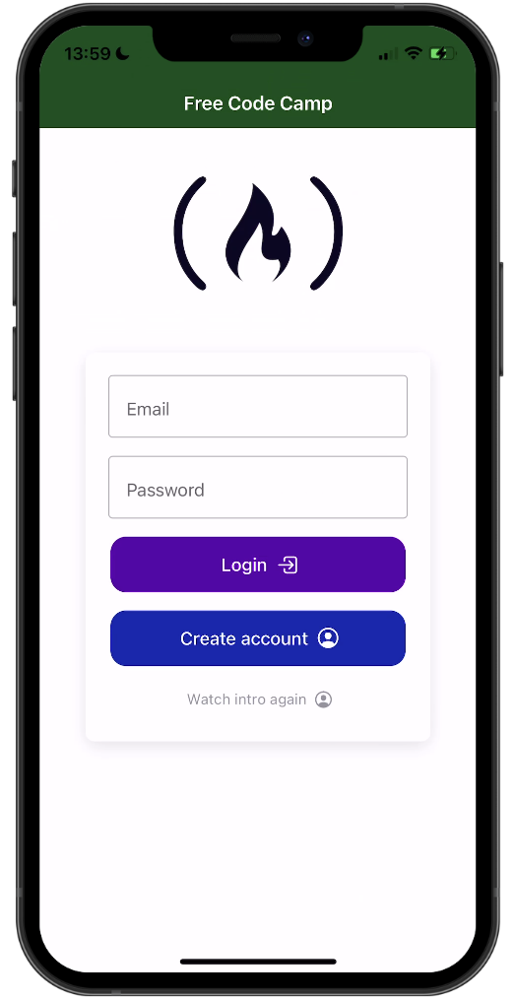
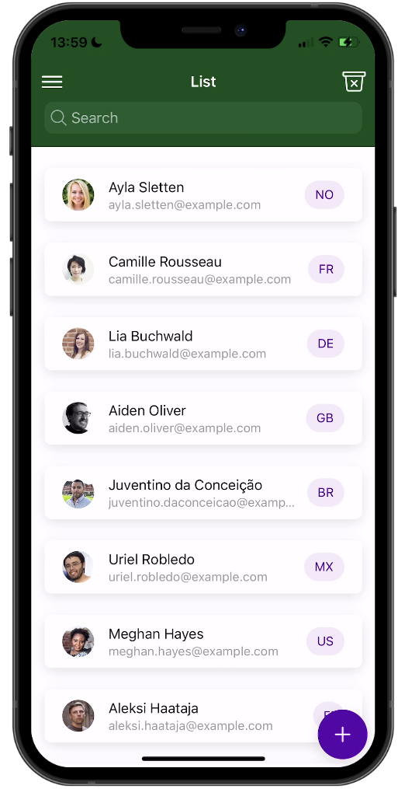
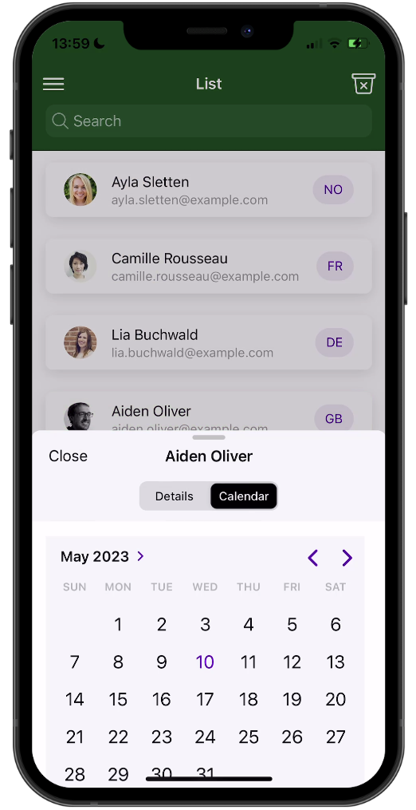

# Ionic React freeCodeCamp Course

This is the [Ionic](https://ionicframework.com/) demo application built with [Capacitor](https://capacitorjs.com/) for the [freeCodeCamp YouTube channel](https://www.youtube.com/@freecodecamp).

## Instructions

Simply install the dependencies with `npm install` and then bring up the preview using `ionic serve`!

## Links

Want to connect? You can find me at:

- [Twitter](https://twitter.com/schlimmson)
- [YouTube](https://www.youtube.com/@galaxies_dev)
- [The Ionic Academy](https://ionicacademy.com/)
- [Newsletter](https://devdactic.com/)

## Preview

